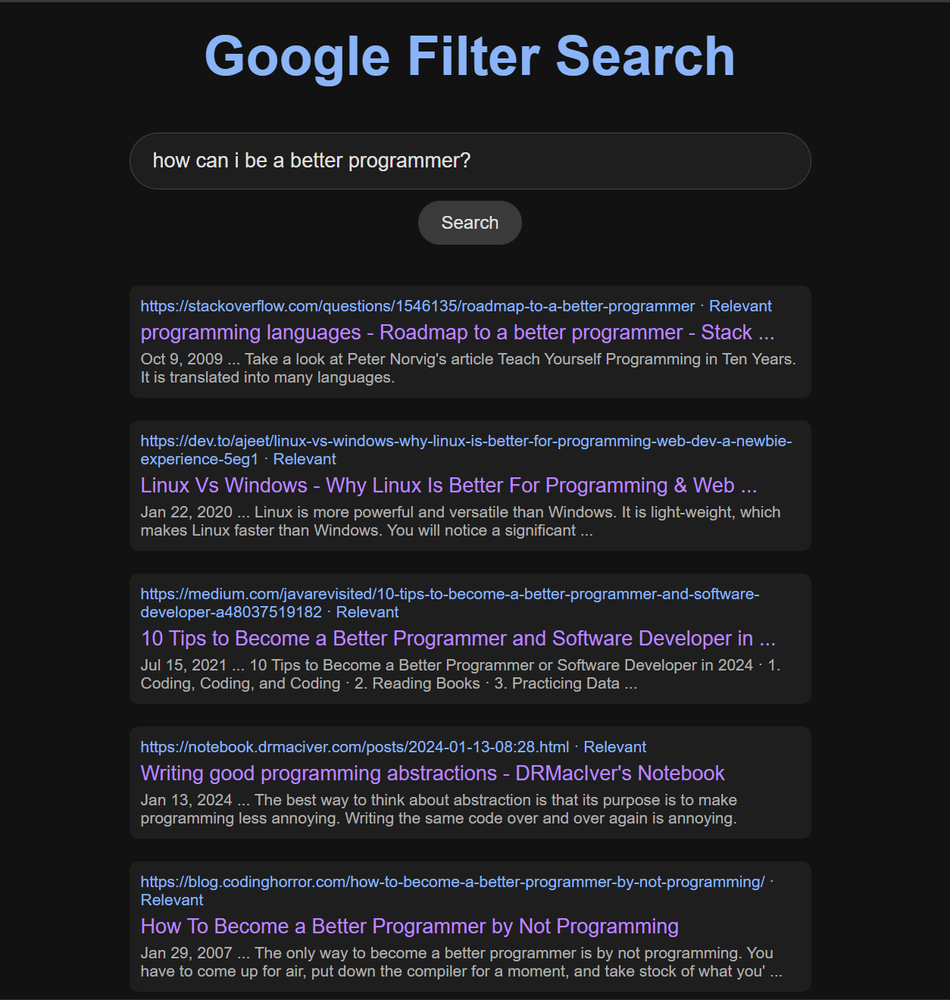

# 🚀 **Filtered Search Engine**

Welcome to the **Filtered Search Engine** project! This search engine retrieves and filters results from the Google API, ensuring that only relevant, accurate information is displayed—free from sponsored or misleading content. 🎯

## 📑 **Table of Contents**
- [Introduction](#introduction)
- [Features](#features)
- [Technologies Used](#technologies-used)
- [Setup Instructions](#setup-instructions)
- [Usage](#usage)
- [Screenshots](#screenshots)
- [License](#license)

## 💡 **Introduction**

The Filtered Search Engine aims to provide users with **relevant** and **unbiased** search results, free from ads and misleading content. With customizable filters, it ranks results based on user preferences.

## ✨ **Features**
- 🔍 Fetches search results from the Google API
- 🎛️ Filters results by relevance
- 🚫 No sponsored or irrelevant content
- 📊 Intuitive results display with easy navigation
- ⚙️ Scalable and flexible filtering options

## 🛠 **Technologies Used**
- **Flask**: Web framework for building the app
- **pandas**: Data manipulation library for handling search results
- **requests**: HTTP requests to interact with the Google API
- **BeautifulSoup4**: Web scraping for parsing HTML from retrieved pages

## 🛠️ **Setup Instructions**

1. **Clone the repository:**
   ```bash
   git clone https://github.com/yourusername/filtered-search-engine.git
   cd filtered-search-engine
   ```

2. **Install the required dependencies:**
   ```bash
   pip install -r requirements.txt
   ```

3. **Set up the Google API key:**
   - Obtain a Google API key from [Google Developer Console](https://console.developers.google.com/).
   - Add the API key in your file:
     ```bash
     GOOGLE_API_KEY=your-api-key
     ```

4. **Run the Flask app:**
   ```bash
   flask run
   ```

5. **Access the app** in your browser at `http://127.0.0.1:5000/`.

## 🖱️ **Usage**

1. Enter a search term on the homepage.
2. View filtered, ranked results retrieved from the Google API.
3. Click links for more details.

## 📸 **Screenshots**

Here’s a preview of the app:

- **Example 1:**
  
  

- **Example 2:**

  

## 📄 **License**
This project is licensed under the MIT License. See the [LICENSE](LICENSE) file for details.
